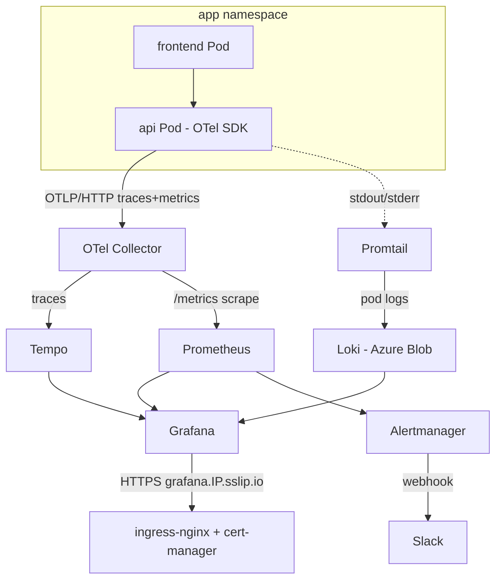

# Azure M3 — Observability stack on AKS (Prometheus, Grafana, Loki, Tempo, OpenTelemetry)

Makes the [M1/M2 notes app](https://github.com/i-robert2/azure-m1-aks-3t) **observable** end-to-end on AKS: **metrics** with Prometheus, **dashboards** with Grafana, **logs** with Loki + Promtail (backed by **Azure Blob**), **distributed traces** with Tempo, all fed by **OpenTelemetry** instrumentation in the API. SLOs are defined as code, **PrometheusRule** alerts fire on error-budget burn, and **Alertmanager** posts to a chat webhook. Grafana is exposed over HTTPS via ingress-nginx + cert-manager (sslip.io, no domain needed).

> Built as a hands-on learning project. The whole stack was deployed for real on M1's AKS (swedencentral), verified (logs, traces, dashboards, a real alert firing to Slack), and torn down.

> **Why OSS, not Datadog?** Most paying jobs use a hosted vendor (Datadog leads). This stack teaches the identical loop — instrument → ship metrics/logs/traces → query → alert — for ~€5/mo instead of ~€150/mo, and **OpenTelemetry** keeps it vendor-neutral: the same instrumentation exports to Datadog/New Relic/Honeycomb with no code changes.

---

## Architecture



---

## What gets observed / created

| Piece | How | Notes |
|---|---|---|
| Metrics + alerting | **kube-prometheus-stack** (Helm) | Prometheus, Grafana, Alertmanager, kube-state-metrics, node-exporter |
| Logs | **Loki + Promtail** (Helm) | chunks stored in an **Azure Storage account** (survives pod restarts) |
| Traces | **Tempo** (Helm) | OTLP ingest, queried in Grafana |
| Instrumentation | **OTel Collector** + **OTel SDK** in the api | auto-instruments HTTP + pg; traces→Tempo, metrics→Prometheus |
| Dashboards | 3 community + 1 custom SLO dashboard | cluster, pods, node, `Notes API — SLO` |
| SLOs / alerts | `observability/slos.yaml`, `alerts.yaml` | HighErrorRate (warn), FastBurnSLO (critical) |
| Delivery | Alertmanager → **Slack** webhook | URL kept out of git (rendered file is gitignored) |

Infra is M1's base (re-applied, state key `m3.tfstate`) **plus** a Storage account for Loki (`terraform/loki.tf`).

---

## Repository layout

```
app/                          M1 app; api now bootstraps OpenTelemetry (src/tracing.ts, first import)
charts/notes/                 M1 Helm chart; api Deployment gets OTEL_* env (values.otel)
observability/
  kps-values.yaml             kube-prometheus-stack (Grafana ingress, retention, resources)
  loki-values.yaml            Loki SimpleScalable + Azure Blob (REPLACE_LOKI_SA/KEY -> rendered)
  otel-values.yaml            OTel Collector: OTLP in -> Tempo traces + Prometheus metrics
  alerts.yaml                 PrometheusRule (release: kps) — HighErrorRate, FastBurnSLO
  slos.yaml                   SLOs as code (availability, read/write latency)
  slo-dashboard.json          custom Grafana SLO dashboard
  alertmanager-slack.yaml     Alertmanager -> Slack (REPLACE_SLACK_WEBHOOK -> rendered)
terraform/                    M1 base + loki.tf (storage account), key m3.tfstate
k8s/clusterissuer.yaml        Let's Encrypt ClusterIssuer
```

> `*.rendered.yaml` (the files with the storage key / webhook) are **gitignored**.

---

## Prerequisites

- M1's base re-applied in swedencentral (AKS/ACR/KV/PG) **+** the Loki storage account, plus ingress-nginx + cert-manager (see Setup).
- **kubectl**, **Helm**, **Azure CLI**, **Terraform**.
- A **Slack incoming webhook** URL (or Teams) for alert delivery.

---

## Setup

**1 — Infra** (M1 base + Loki storage)
```bash
cd terraform
terraform init -backend-config=backend.hcl
terraform apply
az aks get-credentials -g $(terraform output -raw resource_group) -n $(terraform output -raw aks_name)
# ingress-nginx + cert-manager + ClusterIssuer (see M1 README), then note the ingress LB IP.
```

**2 — kube-prometheus-stack** (Grafana on sslip.io)
```bash
IP=$(kubectl get svc ingress-nginx-controller -n ingress-nginx -o jsonpath='{.status.loadBalancer.ingress[0].ip}')
GHOST="grafana.${IP//./-}.sslip.io"
helm repo add prometheus-community https://prometheus-community.github.io/helm-charts && helm repo update
helm upgrade --install kps prometheus-community/kube-prometheus-stack -n monitoring --create-namespace \
  -f observability/kps-values.yaml \
  --set grafana.adminPassword=<pick-one> \
  --set grafana.ingress.hosts[0]=$GHOST \
  --set grafana.ingress.tls[0].secretName=grafana-tls \
  --set grafana.ingress.tls[0].hosts[0]=$GHOST --wait
```

**3 — Loki + Promtail** (Azure Blob)
```bash
SA=$(terraform -chdir=terraform output -raw loki_storage_account)
KEY=$(terraform -chdir=terraform output -raw loki_storage_key)
sed -e "s/REPLACE_LOKI_SA/$SA/" -e "s|REPLACE_LOKI_KEY|$KEY|" observability/loki-values.yaml > observability/loki-values.rendered.yaml
helm repo add grafana https://grafana.github.io/helm-charts && helm repo update
helm upgrade --install loki grafana/loki -n loki --create-namespace -f observability/loki-values.rendered.yaml --wait
helm upgrade --install promtail grafana/promtail -n loki \
  --set "config.clients[0].url=http://loki-write.loki.svc.cluster.local:3100/loki/api/v1/push"
rm observability/loki-values.rendered.yaml
```

**4 — Tempo + OTel Collector**
```bash
helm upgrade --install tempo grafana/tempo -n tempo --create-namespace \
  --set tempo.metricsGenerator.enabled=false --set tempo.persistence.enabled=true --set tempo.persistence.size=5Gi
helm repo add open-telemetry https://open-telemetry.github.io/opentelemetry-helm-charts && helm repo update
helm upgrade --install otelc open-telemetry/opentelemetry-collector -n monitoring -f observability/otel-values.yaml
```

**5 — Deploy the OTel-instrumented app** (build the new api image, then `helm upgrade` the `notes` chart — the api now ships traces+metrics to the collector via `OTEL_EXPORTER_OTLP_ENDPOINT`).

**6 — Dashboards, alerts, SLOs, Slack**
```bash
kubectl apply -f observability/alerts.yaml                     # PrometheusRule (release: kps)
# Grafana > Dashboards > Import: 15760 (cluster), 13770 (pods), 1860 (node), + slo-dashboard.json
sed "s|REPLACE_SLACK_WEBHOOK|$SLACK_WEBHOOK|" observability/alertmanager-slack.yaml | kubectl apply -f -
kubectl rollout restart -n monitoring statefulset/alertmanager-kps-kube-prometheus-stack-alertmanager
```

Add Grafana data sources: **Loki** `http://loki-read.loki.svc.cluster.local:3100`, **Tempo** `http://tempo.tempo.svc.cluster.local:3200`.

---

## Verify

- `kubectl get pods -n monitoring|loki|tempo` — all Running.
- `https://grafana.<ip>.sslip.io` loads with a valid Let's Encrypt cert.
- Grafana → Explore → **Loki** `{namespace="app"}` → log lines.
- Grafana → Explore → **Tempo** → search service `notes-api` → traces (HTTP → pg spans).
- 3 dashboards + the SLO dashboard render.
- Hammer the broken endpoint to force 5xx → **HighErrorRate** fires within 5 min and posts to Slack.

---

## Reusability — what to change

| Change | Where |
|---|---|
| Region / cluster | `terraform/terraform.tfvars` |
| Grafana host | `--set grafana.ingress.hosts[0]=…` |
| Retention / resources | `observability/kps-values.yaml` |
| Loki storage | `terraform/loki.tf` + `loki-values.yaml` |
| Trace/metric endpoint | `charts/notes/values.yaml` `otel.endpoint` |
| Alert thresholds / SLOs | `observability/alerts.yaml`, `slos.yaml` |
| Alert receiver | `observability/alertmanager-slack.yaml` |

---

## Security notes

- **No secrets in git.** The Loki storage key and the Slack webhook are injected into `*.rendered.yaml` files at apply time — both gitignored. Grafana's admin password is passed via `--set`, never committed.
- **Private log storage.** Loki's blob container is private (no anonymous access), TLS 1.2 minimum.
- **Real TLS on Grafana.** cert-manager issues a genuine Let's Encrypt cert for the sslip.io host.
- **Vendor-neutral instrumentation.** OpenTelemetry decouples the app from any single backend — no proprietary agent baked in.

---

## Best practices demonstrated

- **The three pillars** — metrics, logs, and traces — correlated in one Grafana.
- **OpenTelemetry** auto-instrumentation: HTTP spans nested over pg query spans, zero hand-written spans.
- **SLOs + error-budget burn-rate alerting** (fast-burn = page), the SRE-workbook pattern, defined as code.
- **Durable log storage** on object storage instead of ephemeral pod disk.
- **Alert routing by severity** to chat — warn vs page.

### Build-it-from-scratch path

1. kube-prometheus-stack first; get Grafana up over HTTPS and the cluster dashboards green.
2. Loki + Promtail; query `{namespace="app"}` in Explore (start `filesystem`, then move to Blob).
3. Tempo + OTel Collector; add the SDK to the api (first import!), confirm a trace appears.
4. Wire app metrics through the collector; build the SLO dashboard from real metric names.
5. PrometheusRule alerts + Alertmanager → Slack; force 5xx and watch it page.

> Gotcha to internalize: **OTel metric/label names vary by SDK version** — after install, read the actual names off Prometheus (Status → Targets / the collector's `:9464`) and adjust `alerts.yaml`/`slos.yaml`/the SLO dashboard to match. The `release: kps` label on the PrometheusRule is mandatory or the operator ignores it.

---

## Real-world scenarios

- **Production observability on Kubernetes** — the de-facto OSS stack for teams not on a paid APM.
- **Vendor-neutral instrumentation** — OTel lets you switch backends (Datadog/New Relic/Tempo) without touching app code.
- **SLO-driven on-call** — burn-rate alerts page only when the error budget is genuinely at risk, cutting alert fatigue.
- **Centralized, durable logs** — object-storage-backed Loki is a cheap alternative to ELK/Splunk for many workloads.

---

## Cost

The stack is open source (€0 licensing). Added on top of M1: extra pod pressure may add a node (0–25 €/mo depending on autoscale) and the Loki blob storage (< 1 €/mo for ~10 GB). A deploy-verify-destroy session is ~€2–3. `helm uninstall` the stacks, then `terraform destroy` returns spend to ~€0.

---

## License

MIT — see [LICENSE](LICENSE).
